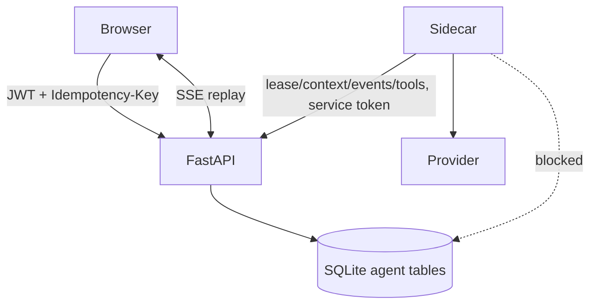
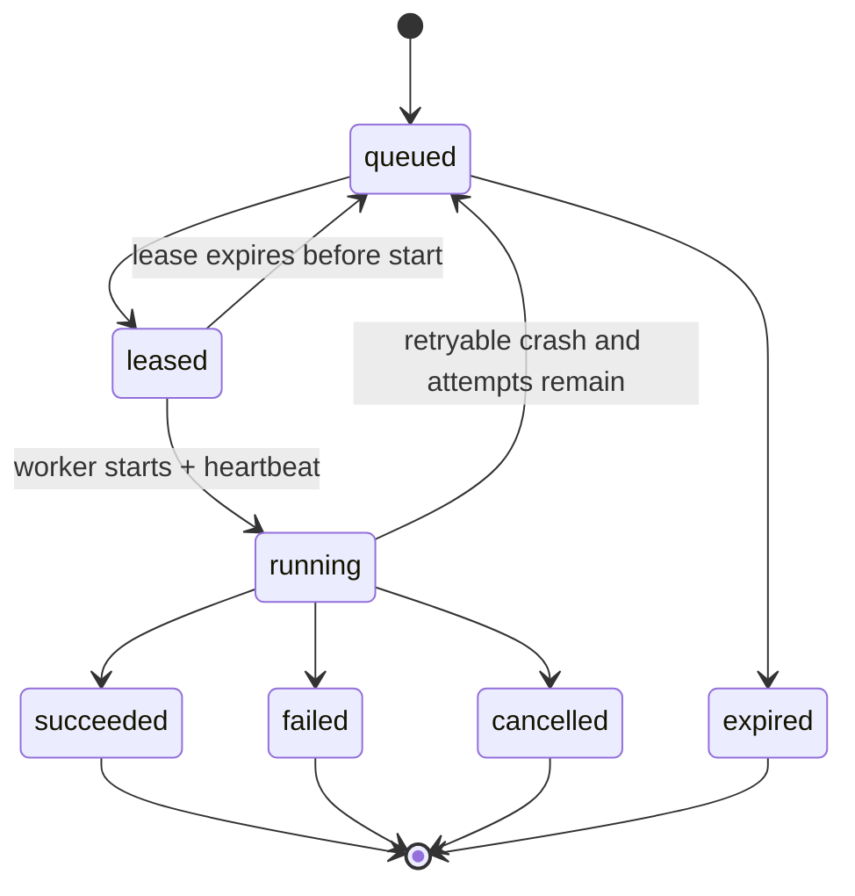

# V2.1 Agent Runtime 技术设计

## 拓扑

FastAPI 是控制面和数据面入口；sidecar 是无业务 DB 的执行 worker。交互 Run 与 Steward Job 都写入同一 durable queue，由 sidecar lease；这避免首版引入 Redis/消息队列。

## Run/Job 状态机

Run 终态不可复活；重试创建 attempt/lease 记录但保持逻辑 run identity。副作用工具由 `run_id + tool_call_id + tool_version` 幂等键去重。

## 内部端点

- `POST /internal/agent/jobs/lease`
- `POST /internal/agent/jobs/{id}/heartbeat`
- `GET /internal/agent/runs/{id}/context`
- `POST /internal/agent/runs/{id}/events:append`
- `POST /internal/agent/runs/{id}/tools/{tool}:execute`
- `POST /internal/agent/runs/{id}:settle`

所有端点只接受 mTLS 或短期 service token（首版可先签名 token，部署仍限制内部网络）。用户 JWT 不可调用 internal 路由。

## Pi 适配

- `FamilyGraphResourceLoader` 只注册 allowlist tools 与 `familygraph-policy-guard`。
- `session.subscribe` 将 message/turn/tool_execution/settled 广播推入事件缓冲；不会改变行为。
- `pi.on` 留给 input/context/tool_call/tool_result/before_provider_request 等决策钩子。
- AgentMessage 到持久化事件再到 UI message 的转换有显式 schema，不直接保存 Provider 私有 payload。

## SSE

事件字段：run_id、event_id/seq、type、public_payload、created_at。事务插入后发布进程内通知；重连从 DB 查询。keepalive 不必持久化。清理策略只可在 Run 终态且客户端可用快照后执行。

## Provider

Provider secret 只在 sidecar/ProviderGateway 安全配置中解密；日志、事件、tool result 和 browser payload 均不得出现。每次调用固定 provider/model/policy_version，重试不跨 Provider。

## 安全失败

未知/非法事件不落公开 stream；内部协议错误记录 security audit。Sidecar 无法取得 scope context 时 Run 失败，不构造空权限/管理员上下文继续。
