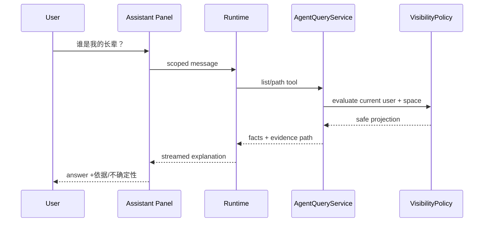

# V2.2 只读 Assistant 技术设计

## 后端查询门面

新增 `AgentQueryService`，把 Foundation 的 VisibilityPolicy 与现有 graph/profile/search 组合成稳定、分页、有上限的只读工具。工具返回 `fact_state`、`evidence_ids/path`、`visibility_level` 和展示安全 payload；不得返回 ORM 对象或 masked 原值。

建议工具：

- `fg_get_self_context@v1`
- `fg_list_visible_people@v1`
- `fg_get_profile_summary@v1`
- `fg_search_space@v1`
- `fg_get_relationship_path@v1`
- `fg_explain_structural_path@v1`

## 回答流程

## 前端结构

- `App.vue`：AssistantLauncher/Panel 宿主。
- `api/agent.ts`：Session/Message/Run/Events。
- `stores/agent.ts`：按 `space_id` 分区的 session summaries 与 active run；不把不同 scope 混入同一数组。
- `composables/useAgentStream.ts`：鉴权、重连、Last-Event-ID、cancel、dispose。
- `components/agent/*`：Launcher、Panel、SessionList、MessageList、Composer、ToolSummary、ScopeBanner。

桌面与移动复用消息内容层，只有容器不同；不要维护两套会话逻辑。

## 空间切换

切换前：停止旧 stream、持久化或丢弃草稿（按 Session）、清空 active message projection；切换后按新 space 重新拉 Session。旧 scope store 可保留非敏感摘要缓存，但必须以 `(account_id,space_id)` key 隔离；首版优先清除。

## 错误与可访问性

结构化错误码映射为用户文案：scope revoked、provider unavailable、local required、run busy、tool denied、stream lost。抽屉/全屏使用 focus trap、Esc/返回、焦点回 launcher；流式新增内容用非打断式 live region。
