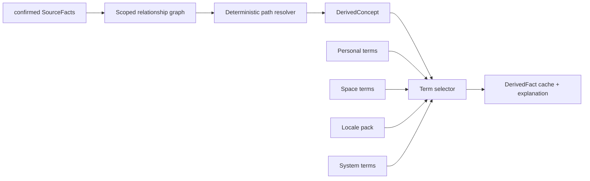

# V2.3 Relationship Intelligence 技术设计

## 模型

- `source_facts(id, type, subject, object, space_id, asserted_by, state, raw_term_id, provenance, revision)`。
- `derived_facts(viewer_profile_id, target_profile_id, space_id, concept_code, path_json, evidence_hash, algorithm_version, term_version)`。
- `term_entries(concept_code, level, owner/space/locale, term, status, revision)`。
- `term_usages(term_entry/candidate, account_id, profile_id, space_id, source_event)`；同一账号重复不计第二位使用者。
- `raw_relation_inputs(text, author, context, created_at)` 保留原文。

## 计算管线

路径只使用当前 space 可消费的确认事实；bridge 仅在 actor 有权访问两侧时进入 PersonalFamilyView，Steward 单空间计算不跨桥遍历另一空间私有事实。

## 路径语义

边携带 parent subtype、partner/spouse、guardian、direct sibling。算法生成规范 step 序列，再映射 concept code。姻亲与继亲不与血缘混写；多路径按最少确认边、较少不确定/社会边、稳定 ID 次序选主路径。

## 自然语言解析

Extractor 不直接执行写命令。其输出 schema 包含 raw_text、candidate concept/source-fact commands、token clues、evidence path、resolution class、clarifying_question。后端重新验证候选与当前图：只有能由确认路径完全证明的展示概念可 determined；SourceFact 候选至少 supported。

## Term 选择与学习

个人修改立即创建/更新 personal entry。空间候选要求两个不同 identity_confirmed account 的有效 usage，系统在事务中晋升为 `space_suggested`；删除其中一条 usage 后重新计算资格。管理员不审批，系统也不把它复制到 locale/system。

## 失效

SourceFact revision/state、membership/visibility、Term revision 或算法版本变化写 dirty key；后台/按需重算 DerivedFact。读取必须比较 evidence_hash/version，过期缓存不能返回。
