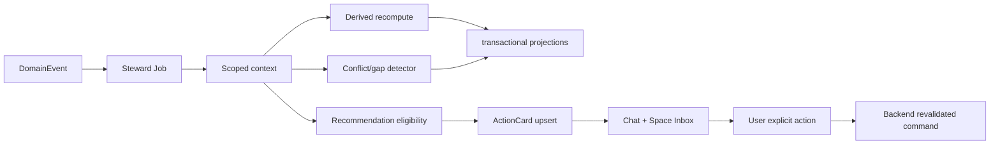

# V2.4 Steward 与 ActionCard 技术设计

## 作业模型

`agent_jobs.kind=steward` 以 space 为分区键；trigger 记录 DomainEvent cursor、requested algorithms 和完整性扫描原因。worker 先通过 ContextBuilder 取得授权快照，再执行纯计算/提案，最后用短事务写 DerivedFact/Card/Projection/checkpoint。

## Steward 可见材料

读取 view 必须以 space_id 建立：确认 SourceFact、当前成员可见 profile projection、DerivedFact、TermRegistry、BehaviorProjection、shared knowledge ids。跨桥只显示当前空间已授权的桥端摘要，不拉取对方空间内部事实。

## ActionCard 模型

字段包括 kind、space、recipient_account、subject/object、evidence_snapshot/hash、proposed_action、privacy_effect、state、expires、dedupe_key、accepted_by/at、executed_event_id、superseded_by。卡片 payload 不存 masked 原值。

状态转换用 compare-and-set revision；accepted 与 executed 分开。执行 command 产生 DomainEvent，并将卡片在同事务置 executed；失败保持 accepted 或转 superseded/failed_reason（产品仅暴露可重试/已失效）。

## 推荐矩阵引擎

确定性规则输入：profile confirmation、Fact type/state、创建选择、双方 disclosure、现有 membership/space bridge/card、cooldown。LLM 只生成解释文案，不能改变 eligible/action set。

## UI

ActionCard store 以服务端状态为真源；会话消息引用 card_id，空间 Inbox 也按 card_id 渲染。任一入口操作后两处同步失效。发送申请采用单独确认按钮/表单并再次显示目标空间和披露影响。
