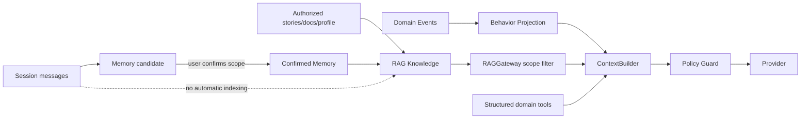

# V2.5 Memory、RAG 与 Policy Guard 技术设计

## 数据流

## 数据模型

- `memory_candidates`：source message span、extractor version、suggested payload/scope、pending/dismissed/confirmed。
- `memories`：confirmed content、raw source refs、scope、sensitivity、revision、retention、revoked/deleted。
- `rag_documents/chunks`：source type/id/revision、space/account scope、visibility snapshot key、sensitivity、text/FTS/embedding status。
- `context_builds/items`：run、source id、included/excluded reason、rank/token estimate/policy version；敏感全文不复制。
- `behavior_projections` 由 DomainEvent cursor 重建。

## 检索

查询先从 Run scope 构造 allow predicate，再查 FTS/embedding；不能先全库相似度再在应用层过滤。结果合并去重后再次调用 VisibilityPolicy/RAG policy，按 token budget 截断，并保留 citation handle。

## Guard 分工

Pi extension 是模型边界的同步屏障：轻量、预取、fail-closed。FastAPI 是数据/工具边界：可访问 DB、进行完整授权并审计。Guard 返回 block/redact/annotate/provider decision；不能返回“临时 admin”。

## Prompt injection

所有 RAG/document/web 内容封装为带 source/scope/trust 的 data block，系统提示明确其指令无效。tool_call 只接受注册 schema；模型即使从文档读到“调用隐藏工具”也无法越过 allowlist。

## 删除与重建

DomainEvent tombstone 使 chunk 立即在查询谓词中失效，再由 projector 物理删除；安全性不依赖异步删除及时完成。FTS/embedding/behavior/context cache 都能从确认真源重建。
