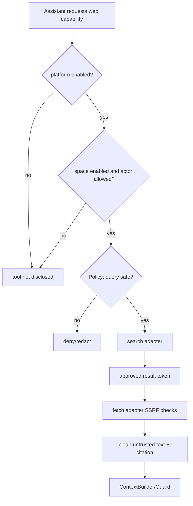

# V2.6 Controlled Web 与发布治理设计

## 能力门

工具定义是否进入 Pi context 与执行权限都检查，避免仅靠提示词隐藏。

## Egress Gateway

Agent sidecar 不直接 fetch；调用 FastAPI/独立 gateway 的受控领域工具。Gateway 在每次 DNS resolve 和 redirect 后验证 IP，限定 https/http、标准端口、响应上限和 MIME。approved token 绑定 URL hash、run/space、过期时间和最大一次使用。

## 外部内容

输出为 `{source_id,url,title,fetched_at,excerpt,content_hash,trust=external}`。正文不自动写 RAG；本轮 Context 由 V2.5 policy 包裹。用户选择沉淀时重新走 MemoryCandidate/确认流程。

## 配置与密钥

平台配置 Provider secret/域名 allow/deny/配额上限；空间配置 enabled、较低配额和允许的用例。space 配置不能覆盖平台 deny。所有 secret 使用 server-side encrypted config/env，轮换后旧值不可回显。

## 部署

api 是唯一公开业务入口，web/nginx 代理 `/api` 与 SSE；agent 只在 internal network。Egress 可通过网络策略仅允许 Provider/Gateway。优雅停机先停止租赁新 Job，再等待/释放 lease。

## 备份恢复

online backup 捕获 SQLite 真源；uploads 一并归档。恢复后运行 integrity_check、关键表计数/约束、Agent event sequence、SourceFact revision、FTS rebuild 与抽样查询；DerivedFact/BehaviorProjection/embedding 可从真源重建。
