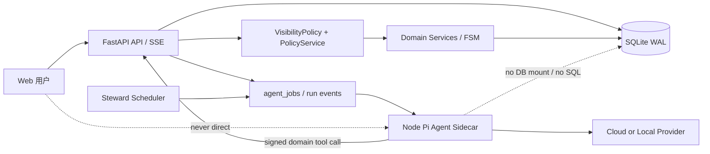
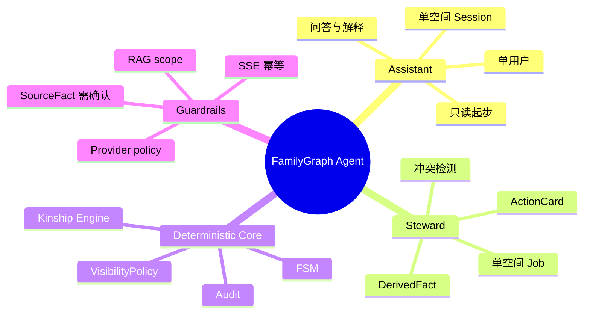
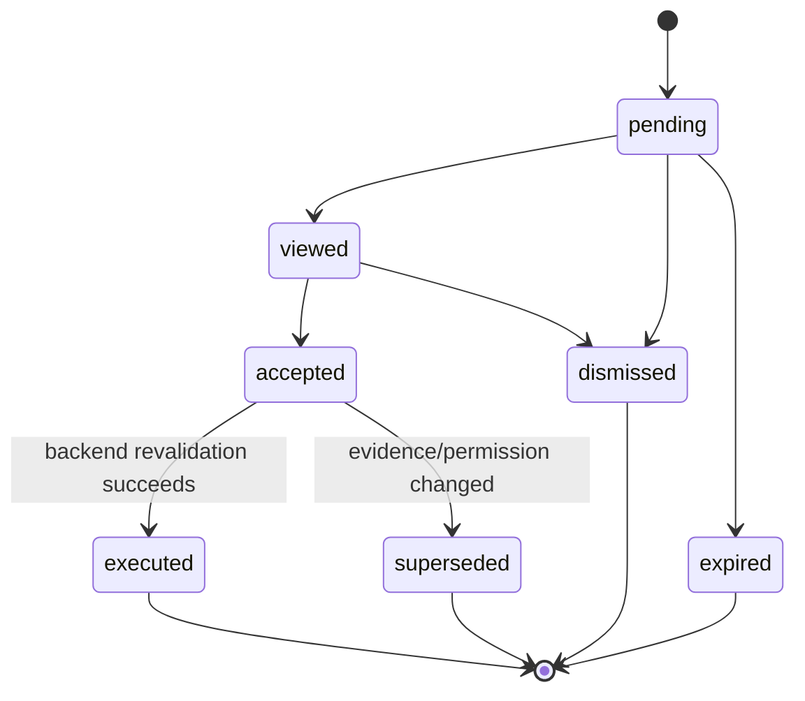

# FamilyGraph v2 Agent 系统总体设计

## 1. 设计目标与边界

系统必须同时满足三个不变量：LLM 不是业务真源；一次运行只绑定一个用户或一个空间；任何读写都经过与普通 API 相同的领域授权。Pi 提供循环、工具与扩展能力，FastAPI 继续拥有身份、事实、空间、可见性、审计和持久化。



## 2. 权威边界

| 领域 | 权威组件 | Agent 可做 | Agent 不可做 |
|---|---|---|---|
| 认证与角色 | FastAPI Account/Role services | 携带运行凭证 | 冒充 operator/admin |
| 空间与可见性 | Space service + VisibilityPolicy | 查询授权投影 | 遍历其他空间或反推遮罩值 |
| 家谱事实 | SourceFact service | 读取、提出提案 | 直接 insert/update SourceFact |
| 关系计算 | Kinship engine | 请求计算、解释结果 | 用 LLM 结论覆盖路径算法 |
| 推荐 | Recommendation + ActionCard | 生成候选卡 | 自动发送申请/自动入空间 |
| Memory/RAG | RAGGateway | 检索当前 scope 白名单 | 原始聊天自动索引、跨 scope 检索 |
| Provider | ProviderGateway | 使用本次策略选定模型 | 静默 fallback 或回显密钥 |

## 3. 运行主体

- AssistantRun：`actor_account_id + space_id + session_id + run_id`；工具权限是当前用户在该空间的实时权限。
- StewardRun：`space_id + job_id + service_principal`；服务主体只证明“这是受信代码”，数据权限仍由 `space_id` 工具合同限定，不继承平台运营者的全局可见性。
- ExtractorRun：继承父 Run 的 scope，只输出候选结构，不单独扩大工具集。



## 4. 关键数据域

### 4.1 身份与空间

`accounts` 是认证主体；`person_profiles` 是人物档案；`profile_claims`/状态字段表达认领与确档；`spaces.kind` 区分 household/lineage；`space_memberships` 表达正式成员与角色；`space_profile_refs` 表达未确档人物在空间中的最小节点引用。PersonalFamilyView 只按请求派生。

### 4.2 事实与称谓

`source_facts` 保存已确认或争议中的原子断言与 provenance；`derived_facts` 保存带 `evidence_version` 的可重建缓存；`term_registry_entries` 保存系统、地区、空间、个人四级词条；原始称谓另存，不被规范词覆盖。

### 4.3 Agent 与事件

`agent_sessions`、`agent_messages`、`agent_runs`、`agent_run_events`、`agent_jobs` 由 FastAPI 持久化。`domain_events` 记录业务动作；`behavior_projections` 是可重建统计/偏好投影；`action_cards` 是用户可见的状态对象；`rag_documents/chunks` 只存允许进入 RAG 的材料。

## 5. 交互 Run 时序

```mermaid
sequenceDiagram
  participant B as Browser
  participant F as FastAPI
  participant D as DB/Event Log
  participant N as Pi Sidecar
  participant M as Provider

  B->>F: POST message (Idempotency-Key)
  F->>D: session/message/run/job transaction
  F-->>B: run_id + SSE endpoint
  N->>F: lease job (signed service token)
  F-->>N: scoped run context + tool manifest
  N->>M: provider request
  M-->>N: text/tool calls
  N->>F: domain tool request(scope token)
  F->>F: Policy + Visibility + domain validation
  F->>D: tool result/audit/event transaction
  F-->>N: redacted tool result
  N->>F: append run events
  F->>D: persist monotonically increasing event id
  D-->>B: SSE events
  B->>F: reconnect Last-Event-ID
  F-->>B: replay only; no re-execution
```

## 6. 写入与推荐语义

SourceFact 只通过用户确认命令写入。DerivedFact 可由确定性引擎自动刷新。Agent 的 supported/ambiguous/conflicting 结果进入 Hypothesis 或 ActionCard。卡片 accepted 不等于写入成功；执行时重新检查身份、scope、事实版本、目标状态和可见性。



## 7. Policy Guard 双层防线

Pi 扩展在 `input/tool_call/tool_result/context/before_provider_request/agent_settled` 处做快速 scope 检查、敏感检测、注入防护和输出脱敏。扩展失败按 fail-closed 处理，但它不是最终授权。FastAPI 领域端点必须再次验证 service token、actor/space scope、工具版本、请求 schema、VisibilityPolicy、领域 FSM 和审计要求。

`context` hook 每个模型轮次触发，不直接查重数据库；ContextBuilder 预取并缓存本 Run 的授权投影。`session.subscribe` 用于流式观察和非阻塞事件采集；会改变行为的决策只能使用 `pi.on`。

## 8. Provider 与敏感路由

- 平台运营者注册一个 OpenAI-compatible 云端配置及可选本地配置，密钥加密存储且永不进模型上下文。
- 空间管理员在平台 allowlist 内选择默认模型与功能开关。
- PolicyService 对每次 provider request 生成 `cloud_allowed | local_required | denied` 决策；local_required 无可用模型时直接返回可解释拒绝。
- Provider 失败不自动切换，以免改变数据出境和成本语义。

## 9. 一致性、失败与恢复

- LLM 调用和外部网络期间不持有数据库事务；每次领域工具为一个短事务，授权、变更、ActionCard 状态和 audit 同事务提交。
- Run/Job 使用 lease、heartbeat、attempt 和终态；sidecar 崩溃后可重试尚未完成的纯计算步骤，带副作用工具以 idempotency key 去重。
- SSE 事件先持久化再广播；浏览器断线只重放。
- DerivedFact、BehaviorProjection 和 RAG 索引均为可重建投影；SourceFact、DomainEvent 和用户确认的 Memory 是不可由模型摘要替代的真源。

## 10. 兼容与迁移

当前没有部署、真实用户或业务数据，因此不设计生产双写、回填、灰度迁移或旧 API 兼容窗口。实现仍应使用前向 Alembic 迁移并验证从空库完整升级。v1 表可以在开发迁移中重构，但不得破坏备份恢复、测试 fixture 和审计语义。

## 11. 主要取舍

- 选择 sidecar 而非 Python 重写 Pi：保留 Pi SDK/扩展生态，同时让 FastAPI 继续做唯一领域真源。
- 选择领域工具而非直接 DB：多一次内部调用成本，换取统一事务、授权、审计与后续数据库可替换性。
- 选择 FTS5 + 可选 embedding 而非独立向量库：符合几十人规模和首版落地目标。
- 选择单空间 Session：牺牲跨空间连续对话，换取清晰的隐私和缓存边界。
