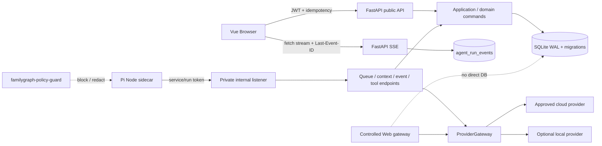
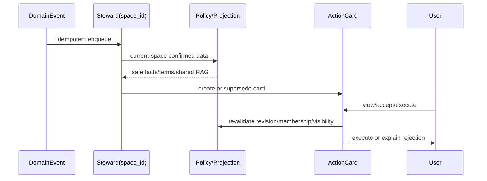

# V2 审计整改与发布就绪技术设计

> 规划状态：Planning。本文定义整改实现边界，不授权执行代码。产品合同以同目录 `prd.md` 为准；审计证据与验证协议见 `research/audit-baseline.md`、`research/verification-protocol.md`。

## 1. 设计目标与不变量

整改只修复已审计的实现和治理缺口，不改变已经确认的 v2 原则：

1. FastAPI 领域服务是身份、空间、SourceFact、VisibilityPolicy、Memory/RAG 和 Agent 状态的唯一业务真源。
2. Assistant 运行身份为 `account_id + session_id + space_id`；Steward 运行身份为 `space_id + job_id + policy_version`。
3. Agent、Pi extension、RAG、Provider、统计和前端都是受限投影，不能扩大后端已授予的可见性。
4. SourceFact、成员资格、公开范围和加入申请只能由有权用户通过领域命令确认；Agent 只能解释、提案或生成 ActionCard。
5. 原始关系输入、原始消息、DomainEvent 和审计证据不可由摘要、词典、缓存或模型输出替代。
6. 删除、撤权、争议和状态变更先在授权查询层失效，再异步清理物理索引和缓存；异步失败不能恢复旧可见性。
7. 未知 scope、schema、provider、证据和策略冲突一律拒绝或返回最小投影。

## 2. 目标拓扑



### 2.1 网络边界

- 公开 FastAPI listener 只挂载浏览器 API、SSE、health 和必要管理端点。
- internal listener 与公开 listener 分离；过渡期若共用进程，反向代理/网络策略必须拒绝宿主和公网到 `/internal/agent`，应用层继续校验 service/run token。目标形态是 sidecar-only private network。
- sidecar 不挂载 SQLite、uploads 或宿主源码，不打开任意 socket；业务读取、写入、Web egress 和 Provider secret 解析全部经过 FastAPI/ProviderGateway。
- production 启动拒绝 `dev-agent-secret-change-me` 等默认 secret；开发环境显式标记后才可使用。

## 3. 数据与事务设计

### 3.1 原子建档命令

新增或收口为一个应用命令，例如：

```python
create_managed_member(
    session, ctx, *, name, relation_input,
    placement, placement_space_id, optional_fields,
    description, idempotency_key,
) -> CreateMemberResult
```

事务固定执行：验证创建者和目标空间；校验名字、关系原文、placement 和字段策略；创建 provisional managed profile/account；append-only 保存关系原文；生成 SourceFact proposal 或按 AD-4 对 managed 新档直接 active；写 `space_profile_ref`（不写 SpaceMember）；追加 domain event/audit；提交幂等响应。任何校验、唯一约束、环检测、权限或事件失败都回滚全部步骤。

已有/已认领账号继续走 pending 合并确认流，不能为了简化绕过确认。幂等键绑定 `actor + command + key + request_hash`；同 hash 返回第一次结果，不同 hash 返回 409。

### 3.2 VisibilityDecision 与字段投影

统一返回不可变对象：

```python
VisibilityDecision(
    visible, level, mask, purpose, policy_version, reasons
)
```

判定顺序：

```text
actor/target identity
→ scope reachability
→ hard status overlay (deleted, provisional, pending, guest, minor, revoked)
→ space/relation trust
→ explicit disclosure (不能突破硬红线)
→ purpose cap
→ field projection
```

任何查询门面只接收 `VisibilityDecision` 或安全 DTO，不接收 ORM 后自行读取字段。`visible_user_ids` 只能用于聚合计数，不能作为读取原始用户行的授权凭据。统计必须使用 `statistics` purpose projection；provisional custody 使用独立的最小 `custody_management` 投影；operator 普通管理列表只返回平台元数据。

### 3.3 数据权利与导出

```text
domain command
  -> policy-filtered export payload
  -> envelope encryption (server key + per-file data key)
  -> short-lived one-time download grant
  -> authorized stream
  -> expiry/revocation cleanup
```

文件目录不能由 nginx 直暴露。下载重新校验 requestor、subject、request state、expiry 和 grant。worker 崩溃由 reaper 将 `processing` 转为可重试/failed 并清扫孤儿临时文件。删除/撤权先写 tombstone、撤销 grant，再做物理清理。

## 4. ProviderGateway

ProviderGateway 是唯一允许使用 Provider secret、发起模型请求和映射错误的模块：

```python
resolve_provider(run_context) -> ProviderRuntime
stream_chat(runtime, messages, tools, *, timeout, cancellation)
probe_readiness(provider_id) -> ProviderReadiness
redact_provider_error(error) -> SafeProviderError
```

数据库 `secret_ref` 由服务端解密并注入 gateway；sidecar 不再自行读取平行环境变量作为真实配置源。凭据只存在受控进程内存，不能写 DB、SSE、context 或普通日志。入队和实际请求前都检查 `allowed | local_required | denied`、配置版本、readiness 和 policy；本地不可用明确拒绝，绝不静默回云；Run 固定 provider/model/policy_version。

## 5. Internal token、schema 与 sidecar

service token 只用于 lease；run token 绑定 `run_id/job_id/agent_kind/account_id/space_id/tool_allowlist/exp/policy_version`。校验顺序固定为签名、typ、audience、过期、任务状态、scope、allowlist、policy version，任一失败写安全审计并返回统一错误。

后端 `app/schemas/agent.py` 与 `app/services/agent_tools.py` 是权威合同；sidecar TypeBox、前端类型和文档通过生成/快照或显式同步脚本对齐。合同测试逐字段比较名称、版本、required、类型、长度、数值范围、枚举、嵌套和 additionalProperties。后端递归校验 min/max length、minimum/maximum、数组、枚举和嵌套对象；未知工具、版本、字段和 malformed JSON fail-closed。

## 6. Run/Event/SSE

`message.user_added` 由消息/入队命令唯一写入，sidecar 只消费。所有事件先写 `agent_run_events` 再广播；`(run_id, seq)` 唯一。reaper、cancel、settle 复用 `append_terminal_event()`：事务内更新状态、写 `run.expired`/`run.cancelled`、审计，提交后通知。Last-Event-ID 只查询缺失事件，不重新 lease 或执行工具；副作用工具使用 `(run_id, tool_call_id, tool_version)` 去重。

审计明确区分 `user_id`、`account_id`、`agent_session_id`、`run_id`；若表需要 account 则另设字段。Provider/HTTP 错误经统一 `redact_secrets` 去除 token、Authorization、URL credential、PII 和长 opaque 值后才能进入日志或 settle error。

## 7. 跨层边界



- Steward 只读一个 `space_id` 的确认事实、投影、词典和 shared RAG，不读私人 Session/Memory、其他空间或 Web。
- ActionCard 是建议状态，不是授权凭据；execute 从服务端 payload 取目标空间和证据版本，再调用 `commit=False` 领域命令并同事务写 executed event。
- Relationship resolver 只消费 confirmed SourceFact；DerivedFact 可删重建；TermRegistry 不覆盖原文或结构语义。
- Memory/RAG 先按 scope/visibility/sensitivity/status/confirmation 过滤，再 FTS/embedding；tombstone 先于物理删除生效；context hook 不查库。
- Controlled Web 只由 Assistant 受控工具调用，外部内容带 `trust=external` 和 citation，不写 SourceFact、Memory 或 Steward 推荐输入。

## 8. 迁移、兼容与回滚

当前无真实数据，允许新增 corrective Alembic migrations、索引、约束和加密文件元数据，不需要双写或在线回填。不得重写历史迁移掩盖当前 schema，也不得以删表让测试只在开发库通过。

回滚按 feature flag 和独立 commit：Foundation 失败关闭新入口但不回到越权旧逻辑；Provider/network 失败关闭 Agent/Web；Event/SSE 失败暂停新 Run 但保留历史；Memory/RAG/Steward 失败关闭对应投影但保留 SourceFact/DomainEvent；导出加密失败禁用下载完成态并清理明文临时文件。

## 9. 观测与性能

记录 command rollback、visibility deny/mask、schema reject、token deny、provider policy/latency/error、lease retry/expired、SSE replay gap、tombstone lag、RAG filtered hits、Web SSRF/PII deny。指标只含 ID/hash/标量；日志可关联 request_id、run_id、job_id、space_id、policy_version，但不输出姓名、关系原文、JWT、PIN、Provider credential、masked 原值或完整敏感 query。

## 10. 明确不采用

- 不把 `created_by` 继续当完整 household detail 快捷授权。
- 不通过 sidecar 环境变量绕过数据库 Provider 配置。
- 不只校验顶层 JSON，不依赖 TypeBox 作为唯一安全边界。
- 不让 reaper 只改状态而不写终态事件。
- 不把行为投影、Agent 摘要或 RAG 命中反写为 SourceFact。
- 不通过临时 admin、全局缓存或旁路 API 解决跨空间访问。
