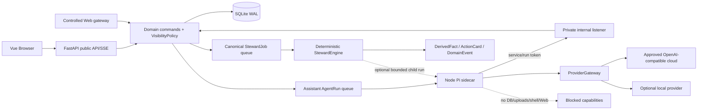
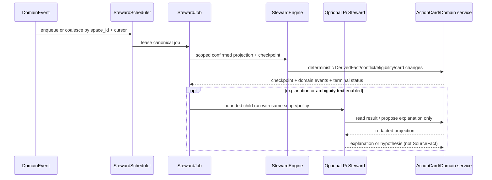

# V2 Agent 架构收口与发布阻断清零技术设计

> 规划状态：Planning。产品要求见同目录 `prd.md`；本设计承接 `08-28-v2-audit-remediation` 的复审，不授权当前会话直接实施代码。

## 1. 设计裁定

### 1.1 Pi 的真实分层

```text
FamilyGraph domain/API/DB  (身份、空间、事实、ACL、FSM、审计、投影)
        |
        +-- Assistant Pi Session
        |     pi-coding-agent  -> pi-agent-core loop/tool/event
        |                         -> pi-ai Provider/model protocol
        |
        +-- StewardJob
              -> deterministic StewardEngine (authoritative)
              -> optional Pi Steward Orchestrator (explain/triage only)
```

- `pi-ai` 只负责模型、Provider adapter 和流式协议。
- `pi-agent-core` 负责 Agent loop、tool dispatch 和事件。
- `pi-coding-agent` 负责 Session、Extension、资源加载和 SDK 外壳。
- FamilyGraph 负责身份、空间、VisibilityPolicy、关系计算、SourceFact、RAG 作用域、ActionCard、数据权利和持久化。
- Pi sidecar 不连接 SQLite、uploads 或任意业务数据库；所有读取/写入都经过 FastAPI 内部协议。

### 1.2 Assistant

Assistant 每次运行绑定 `account_id + session_id + space_id + run_id + policy_version`。FastAPI 预取并投影 context，sidecar 建立受限 `AgentSession`，模型只看到当前 allowlist 的 FamilyGraph 工具。工具结果必须再次通过后端 scope、VisibilityPolicy、schema、FSM 和幂等校验。

Assistant 不得：

- 读取另一个空间的 Session、Memory 或 RAG；
- 直接写 SourceFact、membership、disclosure 或 ActionCard 终态；
- 调用任意 SQL、shell、文件、MCP、浏览器或未授权 Web；
- 把模型输出当作关系真值。

### 1.3 Steward 的最终形态

Steward 是一个产品级系统 Agent，但由两个明确层次组成：

1. **StewardEngine（必选、确定性）**：消费确认 SourceFact、当前空间投影、TermRegistry、BehaviorProjection、共享 RAG 和 checkpoint，重算 DerivedFact，执行冲突/缺口检测，依据固定推荐矩阵生成或 supersede ActionCard。它决定结构结论、eligibility、scope 和 FSM 结果。
2. **Pi Steward Orchestrator（可选、受限）**：以 `space_id + steward_job_id + policy_version` 运行 Pi Session，只能调用只读 context、解释和提案工具。它可以把确定性结果翻译成老人能理解的说明、整理歧义或生成待审文案，但不能改变 engine 的结果，不能直接写 SourceFact、发申请、合并空间或访问 Web。

Pi 编排层失败时，StewardEngine 仍应完成确定性维护；编排层不可用不应阻断基础家谱和 ActionCard 真源。

### 1.4 唯一 Job/Queue 真源

当前存在 generic `AgentJob(kind="steward")` 与 domain `StewardJob` 两套模型。目标形态：

- `StewardJob` 是唯一的空间作业、lease、attempt、trigger cursor、checkpoint 和终态真源；每个 `space_id` 同时最多一个 active job。
- 通用 Assistant `AgentRun/AgentJob(kind="assistant")` 继续使用现有 Pi queue。
- 禁止 generic queue 直接创建第二个 Steward Job。若 Pi 编排需要执行，创建与 `StewardJob` 一一对应的受限 child run，保存 `steward_job_id` 关联，复用父 job 的 scope、policy、lease 和取消结果。
- `StewardJob` 的确定性执行、Pi child run（如启用）和 ActionCard 终态必须由同一领域服务结算；不得出现一个成功、另一个失败的双终态。
- 因无真实数据，可删除未使用的 `AgentJob(kind="steward")` 生产入口或改为兼容读取，但不能保留可写的第二调度路径。

## 2. 目标拓扑



公开 listener 只提供浏览器 API、SSE、health 和必要管理端点。internal listener 只在 sidecar 私网可达；仅靠 nginx 路由隐藏不构成网络边界。

## 3. Steward 作业时序



任何模型调用在事务外进行；正式领域写入使用短事务并重新检查 revision、scope、权限和状态。

## 4. P1 修复合同

### 4.1 VisibilityPolicy

图 API 必须先得到可见节点集合，再用最终集合过滤边；`LEVEL_NONE` 节点不能作为“存在过”的端点。所有 graph/search/agent/RAG/export 出口都消费字段投影，不得仅用 visible ID 再读 ORM 原始字段。

### 4.2 Internal 网络

推荐运行形态：FastAPI 公共进程与 internal FastAPI listener 分离绑定；sidecar 只加入 internal network，Compose 不发布 internal 端口。过渡期间若同进程，必须由 socket/network policy 拒绝宿主和公网，并保留应用 token 双重校验。生产拒绝 `dev-*` service secret。

### 4.3 ProviderGateway

```text
DB provider config + secret_ref
  -> FastAPI resolve/decrypt in gateway boundary
  -> readiness + policy(local_required/cloud_allowed)
  -> stream/timeout/cancel
  -> usage + error mapping + redaction + audit
  -> approved provider egress
```

sidecar 只接收一次运行所需的非秘密模型句柄或通过受控 gateway 代理请求；不得同时从环境变量读取另一份真实 provider 配置。每个 Run 固定 provider/model/policy_version，local_required 无本地时明确失败。

### 4.4 Tool contract

后端 Pydantic/schema registry 是唯一权威；sidecar TypeBox、前端类型和文档从版本快照同步。工具调用先进行版本解析和完整递归 schema 校验，再进行实时 scope/FSM/VisibilityPolicy 校验。副作用工具先原子插入 `(run_id, tool_call_id, tool_version)` 的 processing 记录或使用等价数据库锁，再执行副作用；重放只返回首次安全结果。

### 4.5 数据权利、RAG、Web

- 导出使用成熟 AEAD（例如经项目依赖审查后选定的 AES-GCM/ChaCha20-Poly1305），envelope 保存 algorithm、key id、nonce、ciphertext、tag；解密成功后才 CAS 消费下载资格。
- Memory candidate 的来源校验必须同时绑定 `author_account_id`、`source_session_id` 和 `source_session.space_id`；确认目标 space 必须是当前 session 被授权的空间。
- Web 每次连接前绑定并复核解析结果或使用固定 IP 连接，redirect 每跳重复检查；fetch 使用实际工具用途的策略，不固定查 `research`。
- Provider/HTTP 错误先经过统一安全错误映射和 secret/PII redaction，再进入日志、公开事件和 settle body。

### 4.6 前端竞态

每个 account+space session generation 创建 AbortController；登出、401、空间切换、token_version 变化立即 abort 并清理 members/spaces/actionCards/agent stores。响应提交前检查 generation，旧响应直接丢弃。

## 5. 兼容、迁移与回滚

- 当前无生产数据，可以在同一迁移链中删除未使用的 steward generic 写入路径、增加 `steward_job_id` 关联、重建 export envelope schema 和工具版本快照，不需要双写或回填。
- 保留 append-only DomainEvent、SourceFact、原始关系输入和审计记录；投影、checkpoint、RAG index 可按真源重建。
- 回滚顺序：先关闭 Pi Steward/Steward feature flag；再关闭 Controlled Web；Provider/网络失败时停 sidecar 而不回退到环境旁路；数据导出加密失败时禁用下载完成态并清理临时文件；VisibilityPolicy 失败时返回最小投影/拒绝，不恢复旧越权路径。

## 6. 观测与证据

每个 AC 的证据必须记录：`ac/status/commit/command/exit_code/tests/artifact/notes`。跨进程项必须有合成双用户双空间数据、内部端口负向请求、Provider readiness/错误、Steward job 与可选 Pi child run 的事件序列、SSE Last-Event-ID、恢复后计数和脱敏扫描。

## 7. 设计依据

- `/Users/lyston/Obsidian/lyston/Codex/项目与服务/familygraph/00 FamilyGraph v2 Agent 系统总体架构与设计决策.md`
- `/Users/lyston/Obsidian/lyston/Codex/项目与服务/familygraph/02 FamilyGraph v2 Pi Runtime 与领域工具安全设计.md`
- `/Users/lyston/Obsidian/lyston/Codex/项目与服务/familygraph/04 FamilyGraph v2 Steward、领域事件与 ActionCard 设计.md`
- `/Users/lyston/Obsidian/lyston/Codex/项目与服务/familygraph/05 FamilyGraph v2 Memory、RAG 与 Policy Guard 设计.md`
- `/Users/lyston/Obsidian/lyston/Codex/项目与服务/familygraph/06 FamilyGraph v2 Web、SSE、部署与运行治理设计.md`
- `.trellis/tasks/08-28-v2-audit-remediation/research/audit-baseline.md`
- `.trellis/tasks/08-28-v2-audit-remediation/research/verification-protocol.md`
