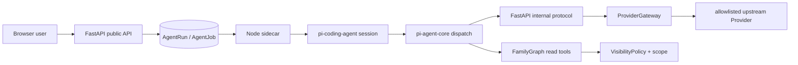

# Design — V2 Agent Runtime Full Repair

## Boundary and invariants

The behavior gap is not “add another SDK”; it is that the existing Pi integration does not consistently enforce the V2 trust boundaries at runtime. The authoritative boundaries remain:

- `pi-coding-agent` owns the Assistant loop/session; `pi-ai` owns the model protocol adapter. No direct `pi-sdk` abstraction is introduced.
- Provider credentials are decrypted only by `ProviderGateway`; sidecar receives a server projection containing a relative proxy URL and no credential.
- Steward remains a deterministic, space-scoped Python queue consumer. It is not a second Pi session unless a future task explicitly adds a child-run contract.
- Every decision that can affect data exposure is made server-side from current DB state; model confidence and prompt text never grant write or visibility authority.

## Provider profile and snapshot

Add a normalized runtime profile (provider id, model id, api adapter, base URL policy, compat, reasoning/input capabilities, context/max tokens, thinking map) and copy it into an immutable `AgentRun.runtime_snapshot` at run creation. The snapshot is used by both context projection and model registration. The only permitted real profile for this task is `liu-dada/gpt-5.6-sol` with the values recorded in PRD; secret material remains encrypted/server-side.

`openai-responses` is the Pi profile's declared API. If the installed `pi-ai` version cannot proxy this adapter through the current internal endpoint, fail closed with a typed provider-unavailable error and document the exact adapter capability; do not silently downgrade to completions. A stub provider test must assert the wire shape before enabling a real request.

## Cancellation and authorization

Create one cancellation signal per leased run and pass it through `session.prompt`/Pi stream options to the provider adapter. On heartbeat `cancel_requested`, membership revocation, client disconnect, or lease expiry, call both the Pi session abort API (when available) and `AbortController.abort()`. Settle is server-authoritative: a cancelled/expired run cannot be reported succeeded by sidecar.

`_authorize_run()` performs a fresh lookup of run status, token claims, account, space and active membership for every internal request. A revoked membership immediately invalidates context, provider, events and tools. Authorization failures use the existing typed errors and append an audit row without revealing existence to an unrelated caller.

## Provider gateway and policy

The internal provider route enforces a streaming body limit before buffering, calls the final backend `before_provider_request` guard on the exact outbound payload, and records an egress audit with byte counts and outcome. Upstream `>=400`, malformed chunks, client disconnect, and cancelled streams all settle failed (with a bounded, redacted error). No external call occurs inside an open DB transaction.

## Queue and sessions

The lease endpoint accepts an explicit kind for sidecar calls and defaults to Assistant only; generic kind is not exposed to the Assistant worker. Maintenance is the sole production producer/consumer for Steward jobs. The worker loads all persisted session messages in order, creates/reuses the Pi session with the full history, and appends each assistant event once using the run sequence/idempotency contract.

## Visibility, terms, and tools

- `graph.py` passes `space_context=space_id` to `visibility.evaluate`; no post-hoc member-only substitute is permitted.
- Term resolution queries the registry in `personal > space > locale > system` order, maps aliases to concept codes, and never mutates `raw_relation_inputs`.
- Backend tool schemas are the source of truth; sidecar TypeBox is generated/updated from the same fields. Recursive validation rejects unknown keys, wrong types, empty/oversized strings, out-of-range numbers, invalid enum values, and invalid array items.
- `record_term_usage` requires a persisted, user-confirmed consent marker tied to the run/session/term; prompt wording alone is insufficient.

## Controlled Web transaction boundary

Claim approved tokens with a short DB transaction (CAS), commit, then perform DNS-pinned egress. If the request cannot start, write a compensating audit outcome and make the token eligible for an explicit retry policy; never hold a transaction open across network I/O.

## Operations and evidence

Compose uses explicit secret requirements and documents them in README, agent health exposes liveness and FastAPI readiness separately, and web has a healthcheck that matches the documented `healthy` claim. Agent has no published port or data volume; only API may egress. Tests include a stub provider success, 503/error, malformed stream, cancellation, and no-secret projection. Every AC in `implement.md` is backed by a command, exit code, test name or artifact before task completion.

## Compatibility and rollback

All changes are behind existing feature flags where possible. Schema additions are additive and safe for the empty pre-deployment database. If provider or cancellation compatibility fails, disable `AGENT_RUNTIME_ENABLED`; no migration rollback or user-data rewrite is required.
