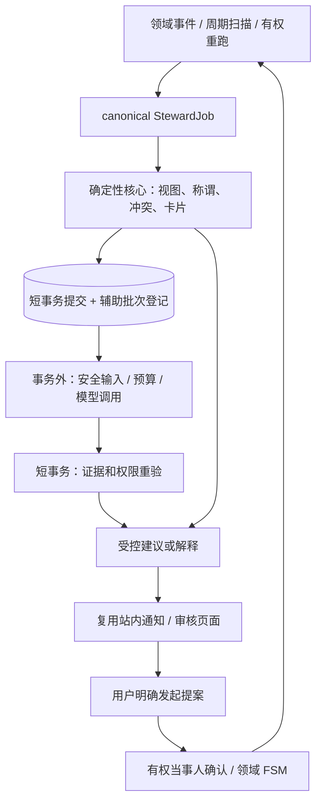

# Steward 整体修复设计

## 当前与目标

当前 engine 和 maintenance 真实存在。目标是在其上修复事务、失效和人工确认，不能用重写运行时掩盖这些缺口。

## 共享约束与模块所有权

- production-ops owns canonical job/scan/retry/admin status。assist-execution 在其上增加受限辅助批次，不在 generic AgentJob 中排第二队列。
- projection-consistency owns 事件影响、PFV/词典/授权 epoch；候选失效和辅助 fence 消费同一版本，不各造一份权限算法。
- quality-security owns prompt/output validator、出站政策适配器与评测；candidate-review owns 审阅 FSM、typed proposal 命令、受众和通知，不能拿 raw 模型响应直接生成 UI。
- release-observability 集成日志/指标/证据；不重复实现 ops API、Notification 或 provider 配置页。

## 跨任务接口（拟定）

1. EventImpact = affected_space_ids / viewer_account_ids / input_epoch / permission_tightened。域命令同事务生成；私有事件不广播。
2. CoreResult = job_id / processed_cursor / evidence_hash / policy_version / safe_stats。core 成功与 auxiliary 成功分别表示。
3. AssistSnapshot = canonical parent job + provider/setting revision + evidence/authorization epoch + recipient + input hash。内存构建最小 payload，DB 只保存 digest/计费/版本。
4. SafeSuggestion = closed kind + typed endpoints + evidence ids/revisions + allowed audience + safe display；无验证输出不公开。
5. SubmitResult = linked pending proposal + required confirmations。owner 接受不等于双方关系确认，Notification read 更不等于接受建议。

接口实现时应保持符号清晰并通过契约测试；字段调整不能放宽上述语义。不要让 Python source_facts FSM 服务承担其没有的 actor 授权。

## 执行顺序

ops → assist-execution / projection-consistency → quality-security → candidate-review → release-observability。
即使探索可并行，实现共享 steward.py/domain_events.py 时要声明文件 ownership、按序合入。用户规定本会话子代理只侦察，主线程负责规划与最终验证。

## 状态与权限

job lease 以 attempt/owner/deadline fence；terminal job 永不复活。auxiliary in_flight 不阻止 core result 可用。
候选表内部状态与公开 Suggestion 分离，SourceFact 只有领域命令允许的操作能变更。confirmed/disputed/revoked 等状态仍由现有 FSM 裁决；所有关系方向与 SOURCE_FACT_TYPES 单一来源。
改权限、事实、词典或模型设置后，旧 projection/ETag/候选/模型结果失效或重新授权，不能仅让前端清缓存兜底。

## 迁移、兼容与发布

迁移顺序随依赖，开始前确认当前 head；不修改用户已有 0035_space_lineage_link.py。旧模型候选/自由解释缺 evidence 时隔离或回退模板，不推断为已验证。不要用批量 confirmed 或补会员来修复“推荐不显示”。
默认模型 assist 关闭；生产 core 按明确配置启用。回滚先停止辅助提交/发起，再关闭 reviewer 和 worker，保留已有提案可处理；任何回滚都不恢复越权旧读取。

## 非目标

不为了 Agent 名称接入 Pi 会话，不扩大平台管理员数据权，不建立全局陌生人匹配、不许 LLM 自主 shell/tool 执行。后两项延期任务只是后续设计入口，不是本发布目标。
