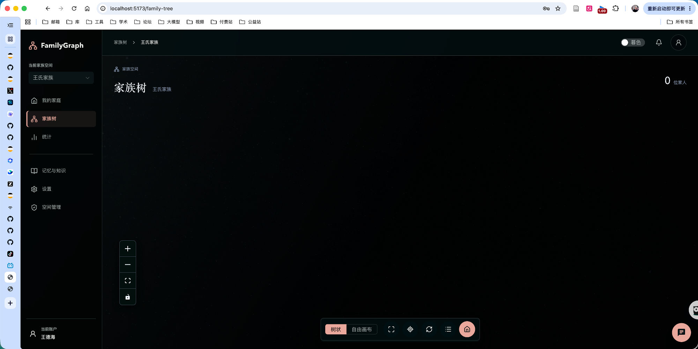
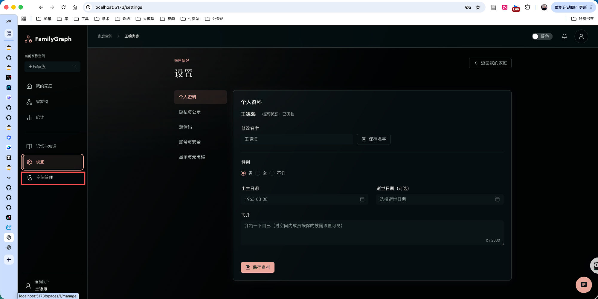

# 家族树版本漂移空视图与侧栏管理员入口闪烁修复

## Goal

修复两个远程开发环境暴露的线上缺陷：

1. **后端**：PersonalFamilyView 物化视图在 policy/computation 版本升级后永久返回空数据——失效→重算→重建的链条存在死锁，不自愈。
2. **前端**：侧栏「空间管理」入口因成员列表「先清空再请求」而间歇消失，且请求失败被静默吞掉后持续消失。

完整排查证据见 `research.md`；本文只保留需求、约束与验收。

## 背景与环境

远程开发模式（`scripts/dev-up-remote.sh`）：后端/数据库跑在 lyston 服务器（systemd user unit `familygraph-api`，WorkingDirectory=`backend/`），本地前端经 launchd SSH 隧道访问 8000/8001/8002。服务器代码由 `familygraph-code-sync.timer` 每 30 分钟同步，但**同步后不自动重启服务进程**。

## 问题描述

### 问题 1：家族树加载不出来（后端）

- 现象：家族树页面显示「0 位家人」，画布空白，无任何报错；`GET /api/personal-family-view?space_id=2` 返回 200。
- 数据库实际有数据：space 2 视图 11 个节点（10 个 `lineage_summary` + 1 个 root `self_private`），但被服务端按「版本不新鲜」拒绝输出。
- 根因链（代码定位见 research.md §3）：
  1. 服务端进程重启带入新版 `policy_version`（`graph` → `v2-foundation-1`；后续提交又引入 `computation_version` `pfv-v1` → `pfv-v2`），旧物化视图判不新鲜；
  2. `view_is_current` 为 False 时 GET 返回**安全空 payload + 200**（fail-closed，本身正确）；
  3. **死锁 A（GET 侧）**：`request_view_recompute` 入队被 steward「succeeded 水位已覆盖」幂等去重吸收，没有新领域事件时重算永不触发；
  4. **死锁 B（worker 侧）**：`rebuild_space_views` 只挑存储状态 `queued/stale/failed/never_computed` 的行，而卡住的行存储状态是 `current`（只是版本字段落后），周期作业（每 ~5 分钟 integrity_scan）永远跳过它们。

### 问题 2：侧栏「空间管理」入口间歇消失（前端）

- 现象：侧栏「空间管理」按钮时不时消失、点不到；空间管理页 `localhost:5173/spaces/1/manage` 本身可达（截图状态栏可见链接目标）。
- 根因链（代码定位见 research.md §4）：
  1. 入口显示条件 `canManageCurrentSpace = canManageSpace && currentSpace !== null`，其中 `canManageSpace` 依赖 `currentRole === 'space_admin'`，而 `currentRole` 解析自 `spaces.members`；
  2. `spaces.loadMembers()` 在发出请求**之前**先 `this.members = []`（`stores/spaces.ts`），重校验在途期间 role 解析为 null → 入口消失；SSH 隧道延迟放大窗口期；
  3. 触发源密集：路由守卫每次进入 spaceManagerOnly 路由都会 `loadMembers`、空间切换事务、多个视图 onMounted——服务器日志可见这些端点在数秒内重复请求多次；
  4. **失败静默**：`switchSpace`/`ensureDefaultSpace` 用 `.catch(() => undefined)` 吞掉失败，members 请求一旦失败（隧道抖动）入口持续消失到下一次成功加载，用户看到的是「没有权限」的假态；
  5. 附带缺陷：路由守卫借 `spaces.loadMembers(targetSpaceId)` 校验授权时顺手把 `currentSpaceId` 改成了目标空间，产生非预期的当前空间切换副作用。

## 已执行的临时恢复（非代码修复）

2026-09-12 在服务器上把 `personal_family_views` 中 2 行版本漂移的 `current` 视图标记为 `stale`（等价于 `invalidate_view_scopes` 在领域事件时的动作），下一个 integrity_scan 周期成功重建并验证 11 节点恢复（research.md §5）。**该恢复会复发**：下次后端进程带 `pfv-v2` 代码重启时，同样的死锁再次发生。

## Requirements

后端（问题 1）：

- **R1 版本漂移可自愈**：视图行 `policy_version`/`computation_version` 与当前代码常量不一致时，必须存在一条确定性的重建路径（worker 周期扫描或 GET 入队），不依赖新领域事件推进水位。
- **R2 入队去重不吞版本漂移重算**：GET 侧 `request_view_recompute` 在「版本不匹配」场景下不得被 succeeded 水位幂等吸收（方案在 design.md 定：如 worker 重建筛选纳入版本比对、或入队改用不受水位门控的 cause、或 GET 判漂移时直接置 stale）。
- **R3 fail-closed 语义保持**：任何修复不得把 stale 投影当 current 返回；`/api/personal-family-view` 响应契约（schema、ETag/304）不变。

前端（问题 2）：

- **R4 成员列表 stale-while-revalidate**：重校验期间保留旧 members 驱动 UI（先请求、成功后整体替换；generation 机制继续防迟到响应串写），消除入口闪断。
- **R5 失败不得静默**：members 加载失败时不允许停留在「看似无权限」的假态——按现有错误态规范给出可见失败态或保留旧态并重试；授权判断本身继续 fail-closed（守卫拒绝放行不变）。
- **R6 守卫无副作用**：路由守卫的成员关系校验不得改变用户当前空间上下文（`currentSpaceId` 不被顺手改写）。

## Acceptance Criteria

- [ ] 后端测试：模拟 `COMPUTATION_VERSION`/`POLICY_VERSION` 升级 + 存量为 `current` 的旧视图，无任何领域事件推进的情况下，GET 后 ≤2 个 steward 周期内视图被重建并正常返回数据（新增回归测试覆盖死锁 A/B 两条路径）。
- [ ] 前端测试：进入 spaceManagerOnly 路由与切换空间时，成员重校验在途期间侧栏入口保持显示（新增回归测试）；members 请求失败时呈现失败/重试态而非静默无权限假态。
- [ ] 路由守卫访问 `/spaces/:id/manage` 前后 `currentSpaceId` 不变（新增回归测试）。
- [ ] 现有守卫 fail-closed 行为不回归：members 校验失败仍拒绝进入空间管理路由。
- [ ] 全量检查通过：`backend ruff/mypy/pytest`、`frontend lint/type-check/test`。
- [ ] 部署提示写入任务 notes：修复上线（服务器 `systemctl --user restart familygraph-api` 使 pfv-v2 生效）时，若用户库仍存 `pfv-v1` 视图，修复本身应直接覆盖该场景（R1 验证即此场景）。

## Notes

- 两问题分属前后端但同根：授权投影的展示层依赖「可被瞬时空白的中间状态」。建议 design.md 一并定方案，实现可分两个提交。
- 服务器侧运维口径（数据直接操作仅限派生投影表）已在本次临时恢复中实践，代码修复落地后不再需要人工干预。
