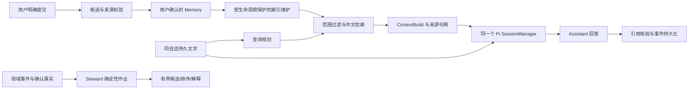

# 技术设计：双 Agent RAG 与记忆治理

> 状态：待审阅方案。现状与复现只以 research/audit.md、research/evidence.json 为准；本文中的目标接口不代表已经实现。

## 1. 架构边界

保持 FastAPI 为数据、授权和模型外发边界；Node sidecar 不直接读库、不新增任意文件/网络工具。Assistant 使用 AgentSession/Run；Steward 使用现有独立作业和辅助批次。

Steward→RAG 的连接仍由既有能力任务评估，不在图中假装已实现。

## 2. 记忆来源与事务合同

目标新增可判别来源：manual、agent_message、rag_chunk；存量无法验证的描述性 doc ref 保留 legacy 标记。HTTP raw_quote 名称保持兼容，ORM source_quote 无需改列名。

- manual：原文、作者和时间来自本次明确输入；不制造授权文档。
- agent_message：一期独立快照仅接受本人会话中本人提交的原始 user 消息，校验角色、归属及原文定位；Assistant、工具及 RAG 派生消息不走此入口。保留不可变来源快照，消息删除不能触发 CHECK 失败或自动变成 manual；未来保存派生消息须保留其引用来源依赖。
- rag_chunk：定位仅是查询参数，服务端回读 document/chunk/revision，检验原作者、原空间、可见性、敏感等级和来源状态；确认及后续读取持续保留该依赖。
- 新客户端必须明确声明 source.kind。旧手工新增和旧 RAG 保存的无来源 payload 无法区分，因此缺来源的歧义请求继续拒绝并提示刷新客户端，不能自动转为 manual。旧 source_message_id 仅在符合上述 user 消息规则时适配；任意字符串 source_document_ref 不作为授权凭据。
- 存量 confirmed 记录保留原文、确认历史及既有 scope/作者边界；来源无法验证或仅能定位 Assistant 派生消息时标记 legacy/unverified，不自动变成 manual。此状态不得新增索引、进入任何 AgentContext 或从已有索引命中；本人管理入口只返回授权范围内的元数据及待验证提示，原文和摘要在来源重新验证前不外发。可验证适配器补齐证据后才恢复相应访问；不得凭迁移提升为 public/authorized、自动重确认或物理删除。

写流程采用 service→flush→构建/验证可 JSON 序列化的响应→commit→返回。候选创建以账户＋幂等键及请求指纹去重；同键异参冲突。确认以候选唯一性和状态转换防止双写，并保存确认参数用于一致重放。

来源依赖不只存在 candidate FK 中；Memory 自身保留索引可定位的原始来源与版本。嵌套 RAG 来源需归一化到有界依赖，拒绝循环和无限复制。来源整体失效、读者暂时失权、legacy 待验证分别处理；后台物化合法性与请求 can_read 共用基础规则而不假扮某个读者。具体字段与兼容迁移由 A 负责，后续 D 复用，不能分别造两套授权器。

## 3. 检索、上下文与引用

### 3.1 一期查询方案

引入有界查询规划值对象：当前问题、可用的同 session 前文、规范化检索项、明确解析的引用对象、降级原因。第一版采用确定性规范化和词法检索，不新增外部模型请求作为必经步骤。

- Unicode/空白/标点规范化，FTS 运算符始终被安全处理。
- 当前精确短语作为一条召回支路；对自然问句生成有限检索项，不能要求整句原样出现。
- 小于三个有效字符的查询有参数化短词后备路径；先限定允许来源，避免全库跨租户 LIKE 扫描。
- 有明确前文的“它/他/那里”等追问才借用有限锚点；歧义时只用当前问题或说明不足，不把其他会话/空间带入。
- 同义表达只承诺冻结数据集中的受控词表/实体别名；开放语义召回由 E 比较收益，不硬编码单个测试句子通过。

排名使用显式 query plan、来源版本和稳定平局规则；作者可见性二次筛除后在扫描预算内补足。ContextBuild 记录实际包含/排除及原因，不记录敏感正文日志。

### 3.2 分块与预算

句/段边界优先、长度有界、有限重叠；来源原文 revision 与 index_version 分开。文档内容不变的重试保持 document/chunk 身份；切分版本升级是可回滚的索引变更，不能混淆为原始内容变更。

B 负责 RAG 子预算的保守估算、包装开销和截选说明。C 只负责历史与 Pi 压缩一致；完整请求的 system/history/current input/tools/output reserve 预算由 E 单独设计。未知模型不得伪称字符数除四就是 token；优先可验证 tokenizer，否则使用说明明确的保守估算并复核 Provider 拒绝路径。

### 3.3 引用合同

复用前端已存在的 citations parser/CitationList。后端 ContextBuild/Items 是本次允许引用的真源；sidecar 必要时保留 context_build_id，并建立句柄到来源元数据的映射。

输出 citations 字段与 web_citations 并列，核心字段对齐现有前端：source_type、source_id、scope、sensitivity、revision、citation_handle。默认不把正文摘录持久化到公开事件；需要展示正文时走当前授权读取。

只认证回答实际使用且属于当前有效 Run/attempt/build 的 included 句柄；相同来源句柄可跨轮复用，拒绝的是错误 build 绑定。B 新增 signed attempt 核验与同 attempt context 幂等，不能假定现有 token 已隔离旧执行。未使用材料不标成答案引用。

事件以原始候选请求指纹保证 (run_id,seq) 幂等，认证后结果不用于同原请求比较；历史/SSE 读取时另外重验并遮罩来源。失效引用以兼容的 unavailable_citation_count 提示，不反显受限 ID/正文。完整引用存入消息元数据，公开事件 16 KiB 容不下时按已授权 run_id/seq 独立补取；不用截断正文。详细字段、旧 token 过渡与读取入口由 B 定义。

## 4. Pi 会话恢复修复

将当前 history 转换提前，在 createAgentSession 前生成同一个 SessionManager.inMemory，按 durable message ID 顺序 appendMessage，再把 manager 交给 SDK；删除单独覆盖 agent.state.messages 的接线。

Pi 0.84.3 的 sdk.js:81 先 buildSessionContext，:239 恢复 agent state，:253 使用同一个 manager。显式本轮 model 仍优先，不从历史切换 Provider。不能用 prompt/sendUserMessage 重放，否则会多跑一轮模型。

保留：最新 user 由 worker 只加入一次；不同 ID 相同文本不合并；历史只为 user/assistant text；旧工具/RAG 原文不跨 Run 重新注入；每 Run 仍是内存 manager。自动/手动压缩都应看见完整合法历史并产生可继续使用的摘要。

失败、取消、租约丢失和重试仍由后端裁决；不为了修复压缩修改现有会话并发约束。跨 Run 摘要和完整请求预算另见 E，不在本修复暗中新增存储。

## 5. 索引补建与失效

D 先修复 index_memory/rebuild_index 的“失效当缺失”问题，再接生产触发：

1. effective RAG 开启时，由独立维护职责扫描有限批次的合法且从未建立当前 revision 的 Memory。
2. 若同 revision 已有 revoked/deleted/invalidated document，不能当缺索引而复活。
3. 原始 Memory active/confirmed、retention、作者/来源生命周期及 A 的依赖必须全部满足。
4. 有效重复索引返回原投影，不删除重建 chunk；唯一约束与事务处理并发。
5. 启动、平台开关开启和中断恢复都能通过下一轮扫描补齐；维护循环启动条件须覆盖“只有 RAG 职责开启”。
6. 全量 FTS 重建只重建合法 chunk 的搜索投影；不改 source 状态和确认记录。

活动版本指针复用 document.index_version；新搜索只读相同版本 chunk，旧引用/保存依赖精确读取原 ID/版本并重验来源。维护游标与活动版本切换必须有持久 attempt/策略版本的条件更新，过期执行者不能回退；唯一约束不代替这一并发保护。无法安全处理的存量重复组阻断新约束和维护启用，不能默默删重。

admin PUT 保持轻事务；不在写开关时全库建索引。不改变当前环境 hard-off 与 DB 开关关系。可观测状态只包括安全计数、游标、耗时、版本、错误码；家庭用户只能看其授权范围的可用/处理中状态，系统管理员不能读取家庭正文。

## 6. 生命周期与兼容

- 保留“候选不是知识”“用户确认不是结构事实确认”的区别。
- 本人原始 user 消息已明确保存的独立快照与聊天删除分开；记录聊天源已删除，不自动伪造新的来源。Assistant/工具/RAG 派生消息不适用此独立快照规则；RAG 副本持续依赖原授权，不能靠私有 scope 绕过原空间。
- 软删除/撤销阻止后续读取与检索；不得承诺从既有聊天回复、外部 Provider 或备份中即时物理擦除。
- A/D 需要迁移时，实施日先查实际 Alembic head，禁止预占序号。迁移先在隔离 DATA_DIR 验证，报告重复、无法解析的旧来源和外键置空情况。
- 支持新旧 HTTP 字段的过渡；不能为兼容任意 doc ref 放松授权。新来源不能被旧程序误当作已授权文档。
- 代码回滚不能要求删除新来源或重启后复活索引；必要时先关闭受影响入口，保留可审计数据，以前滚修复恢复。

## 7. 能力扩展与既有任务

E 的交付是评估包与准入记录，包含主动检索、自动候选/显式保存、授权导入、语义检索、全请求预算、跨 Run 摘要、版本编辑/清理、Steward 反馈及候选证据更新。选择之前不启用外部服务或新隐私范围。

- Steward shared RAG：给 `09-11-steward-capability-followups` 提供修复后的检索合同和至少六个受控对比案例；不重复实施。
- Steward 平台开关：admin API/UI/审计及 owner 原因提示归 `09-13-steward-assist-platform-switch-admin`；只引用依赖。
- 候选结构身份与相关证据版本应分开，先复现 MR-23 再提交最小修复设计。
- Suggestion 冷却到期是否重现、持久摘要/自动提取范围、物理擦除保留期是后续产品决定，本期不默选。
- 行为投影重建必须按键族操作，不能为启用偏好摘要抹掉 kinship recommendation 冷却。

## 8. 文件所有权与并行限制

A：backend memory schema/model/service/API 与 frontend memory API/store/components；迁移序号串行。
C：agent/src/session.ts 及实际 Pi 回归；引用合同由 B 负责。
B：memory_rag/context_builder/internal_agent、agent client/worker/events/prompt、backend agent_events/schema、frontend 既有 citations 链。
D：memory_rag、platform_features、maintenance、必要索引模型/迁移与管理状态；等 A/B 的来源和索引版本合同稳定后实施。
E：研究与评估文件；业务修复需在审阅后另选实施所有者，不直接改既有任务。

默认 A→C→B→D 串行；E 的只读评估可并行。相交文件、迁移、SQLite 主库和服务端口不得并行。每个实施子任务单独 branch/worktree；父子关系不自动执行依赖。

## 9. 风险与验证责任

最大风险是修“能记住”时扩大了原权限，或修“能检索”时复活 tombstone。其次是协议新增字段不兼容、长消息加引用超出事件限制、旧来源迁移丢失 provenance、索引换版让引用漂移。

所有风险须映射真实 API/Pi/迁移/权限反例；完整矩阵见 research/validation-plan.md。当前材料没有证明线上状态与模型质量；实现结束必须另记录实际结果，不能沿用审计前 211 pass 作为修复验收。
