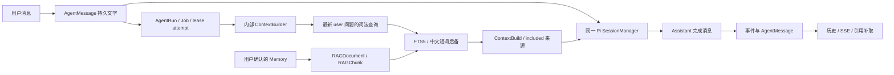
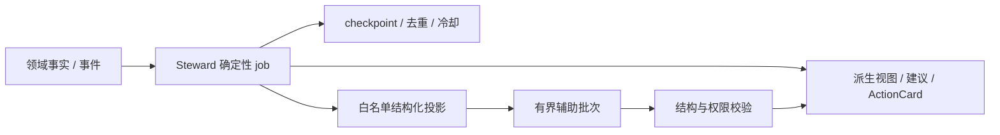

# 两个 Agent 的 RAG 与记忆实际实现

## 读取版本

本次核对的是累计实施分支 `bd899b9`，包含 A、初版 C、B、D；主检出当时为 `d7629df` 并含其他任务未提交内容，不能将累计分支代码称为已合入 main。C 新补丁 `8e91c42` 单独列明。原全量审计来自 [父任务审计](../../09-13-agent-memory-rag-remediation/research/audit.md)，其早期行号和范围不会被本报告改写。

## Assistant：会话文字 + 明确确认的知识 + 每 Run 预取

1. **聊天记忆**：`backend/app/api/internal_agent.py:432` 起按持久消息顺序取同会话历史；`agent/src/session.ts:369` 起按消息ID去重、排除本轮当前user，将允许的user/assistant文字append到同一个内存SessionManager，再交给createAgentSession。worker只提交一次本轮user/RAG。每个Run重新构造，不复用上一Run的Pi摘要、工具结果或thinking。
2. **长期Memory**：`memory_rag.propose_candidate → confirm_candidate → Memory`。A明确manual、本人原始user消息、rag_chunk来源；候选未确认不进入知识检索。RAG派生副本持续受根来源权限/状态约束，private副本不洗掉原空间依赖。主要实现位于`backend/app/services/memory_rag.py`和`memory_sources.py`；旧memory/rag服务门面不代表另一个业务系统。
3. **检索**：`rag_query.py:118`的lex-v1只收当前raw问题；NFKC、受控别名（如过年→春节）、停用词、500字符/8词项边界后进入`memory_rag.search_rag`。底层是SQLite FTS5 trigram/BM25和参数化两字LIKE后备，没有embedding/reranker。分块按句/段优先并有界重叠，默认索引Memory.content（通常是确认摘要），不是自动索引全部raw_quote。
4. **材料与预算**：实际入口是`context_builder.ContextBuilder`，不是另一个同名build_context helper。Build/Items记录included，sidecar把citation/content作为非可信材料拼入本轮问题。当前真实Builder仍len//4，造成B-I06；保守UTF-8 helper存在不能证明该路径已使用。
5. **引用**：目前后端从完成文本解析句柄，查询当前run.attempt的build来认证document，再把citation记入消息；原请求指纹帮助幂等。client已保留context_build_id，但wire没有显式context_reference。精确块证据、SSE/internal投影和fallback定位仍有B-I02～05/I09/I10缺口。

Pi 0.84.3已经有手动、阈值和overflow压缩。C解决的是“恢复的历史是否进入压缩源”，不是增加一个新记忆数据库。初版C已进入累计分支；补丁`8e91c42`进一步修复成功overflow恢复的最终结算，详见[C记录](c/check.md)。跨Run持久摘要与完整请求预算仍未实现。

## 索引维护：已经接入，可靠性仍未完成

`backend/app/services/maintenance.py:108`调用独立RAG维护批次；部署RAG能力开启时，即使Agent/Steward关闭也可运行，平台晚开启后下一tick补齐。有效开关为部署hard-off与数据库覆盖共同约束，不因界面显示开启就意味着已全部索引。

D加入持久state/failure表、游标/轮次、失效原因和版本化chunk键，区分`source_invalidated`与`index_superseded`。新的搜索要求chunk版本等于document活动指针；历史保存依赖可读取保留的旧块。真正运行的租约仍基于ORM字段，未有完整条件更新栅栏；普通ensure还会回写进程版本，0045 downgrade会删非活动块。这些是[D复查](d-integration-check.md)的已复现缺口。

## Steward：持久业务状态与受控辅助，不共享 Assistant 聊天记忆

`backend/app/services/steward_guard.py:101,128,136`对候选、排序、解释分别构造白名单输入；`steward_assist.py:439`的请求为system+user，不恢复Assistant聊天历史。进度、候选身份、证据hash、dismiss状态和ActionCard冷却持久化，是业务状态，不是模型权重训练或通用对话经验。

原MR-19的否定检索覆盖backend/app内Steward→ContextBuilder/search_rag调用以及实际prompt生产点；本轮未发现此次A～D新增Steward RAG消费者，也没有把底层consumer权限分支当成接线证明。相关后续能力仍归既有followups。TermRegistry的真实称谓偏好与使用积累另有生产路径，不能概括为“Steward完全没有记忆”；其他称谓任务的独立新功能需按其提交核验，本任务不接管。

E的合成生产链已复现MR-23：稳定结构去重会挡住新相关证据；MR-26：手动调用行为投影重建在开关开启时会删其他键族冷却。后者当时没有生产rebuild消费者，不能称作已观察到线上持续丢数据。两者仍由`09-13-steward-memory-evidence-projections`规划包负责；本轮未重新测量其在其他新分支的状态。

## 能力比较

| 能力 | Assistant | Steward |
|---|---|---|
| 同会话文字历史 | 持久化，每Run恢复到Pi | 辅助调用不使用聊天历史 |
| 用户确认的长期Memory | 检索并在本轮引用 | 累计基线未接共享RAG |
| 主动检索工具 | 没有memory/RAG工具循环，每Run预取一次 | 无此接线 |
| 自动从聊天记忆 | 默认extractor返回空，须明确确认来源 | 不读取私有聊天形成知识 |
| 压缩摘要 | Pi当次内存manager支持；不跨Run持久 | 无聊天压缩管线 |
| 业务记忆 | 消息、来源、Run/引用记录 | checkpoint、去重、证据、反馈/冷却 |
| 语义检索/学习 | 无embedding/reranker；未证明模型训练 | 结构化辅助；未证明模型经验学习 |

以上是代码与隔离验证结果，不代表真实Provider生成质量、线上开关或用户所有资料都已可检索。
