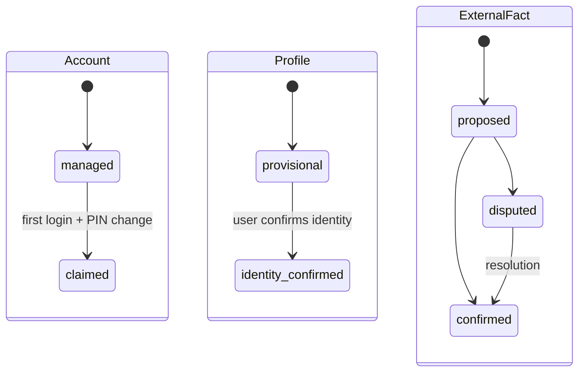

# V2.0 Foundation 技术设计

## 数据模型

- `accounts`：认证、managed/claimed、凭据与 token_version。
- `person_profiles`：展示资料、provisional/identity_confirmed、created_by、custody policy。
- `profile_fact_reviews`：首次确档清单和逐项确认/争议。
- `platform_role_assignments`：仅 platform_operator。
- `spaces(kind)`、`space_memberships(role,status)`、`space_profile_refs(visibility,status)`。
- `owner_invitations(token_hash,expires_at,used_at,revoked_at,created_by)`。
- `disclosure_preferences(account/profile, category, global/space scope)`。
- `ownership_transfers`、`claim_disputes`、`data_right_requests`。
- `domain_events`：投影失效与 Agent 后续消费的稳定事实事件。

命名可在实现前按现有模型风格微调，但概念不得合并回 `users.is_admin`。

## 确档状态

Account claimed 不自动让 Profile 或外部事实 confirmed；三条状态必须分别完成。

## 可见性算法

`VisibilityPolicy.evaluate(actor, target_profile, space_context, purpose)` 先校验目标在 scope 中的可达性，再计算 level 与字段 mask。purpose 只能收紧，不能放宽：`agent/rag/export/search/statistics` 不得得到比 profile API 更宽的投影。

优先级：self → household active → lineage membership/ref → explicit disclosure → none；minor/high-risk overlay 最后再收紧。platform_operator 不在该优先链中，break-glass 走独立审计接口。

## Owner onboarding 与移交

邀请 token 只保存 hash。兑换事务原子消费 token、创建 lineage、创建 owner membership 与 audit。owner transfer 使用 pending → accepted/cancelled/expired FSM；接受事务同时变更 owner 与双方 membership。删除 owner 前查询所有未完成 ownership obligations，存在则 409。

## 数据权利

请求对象统一包含 requestor、subject、type、scope、status、policy_version、created/finished/expires。导出异步生成加密/短期文件；删除先冻结新的 Agent/RAG 处理，再删除真源并发布 tombstone/invalidation event；争议处理不覆盖原始证据。

## 领域命令

新增 application service 层作为事务边界。HTTP 路由只完成 schema/身份解析并调用命令；未来 Agent domain tool 也调用同一命令。命令不接收来自模型的 actor override，actor 由认证上下文构造。

## 兼容策略

无真实数据，允许通过新 Alembic 迁移重构表和约束；仍保留可从 v1 空库顺序升级的测试。不能通过删掉迁移历史制造“只在开发机可用”的 schema。
